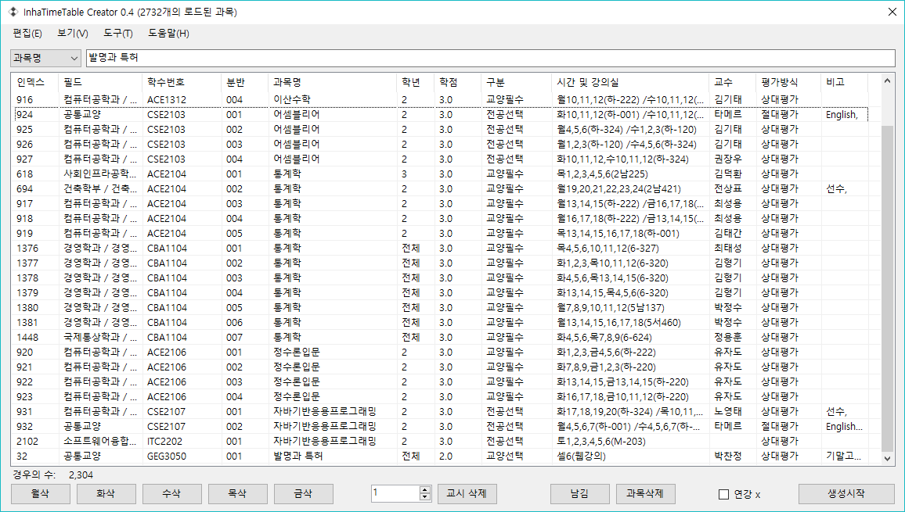
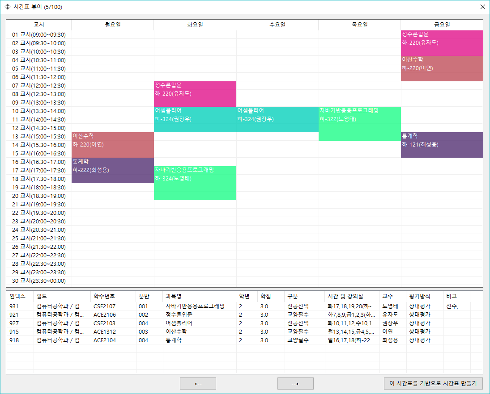
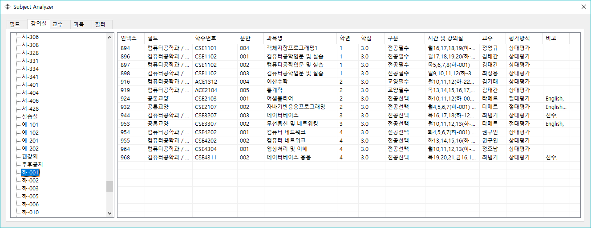
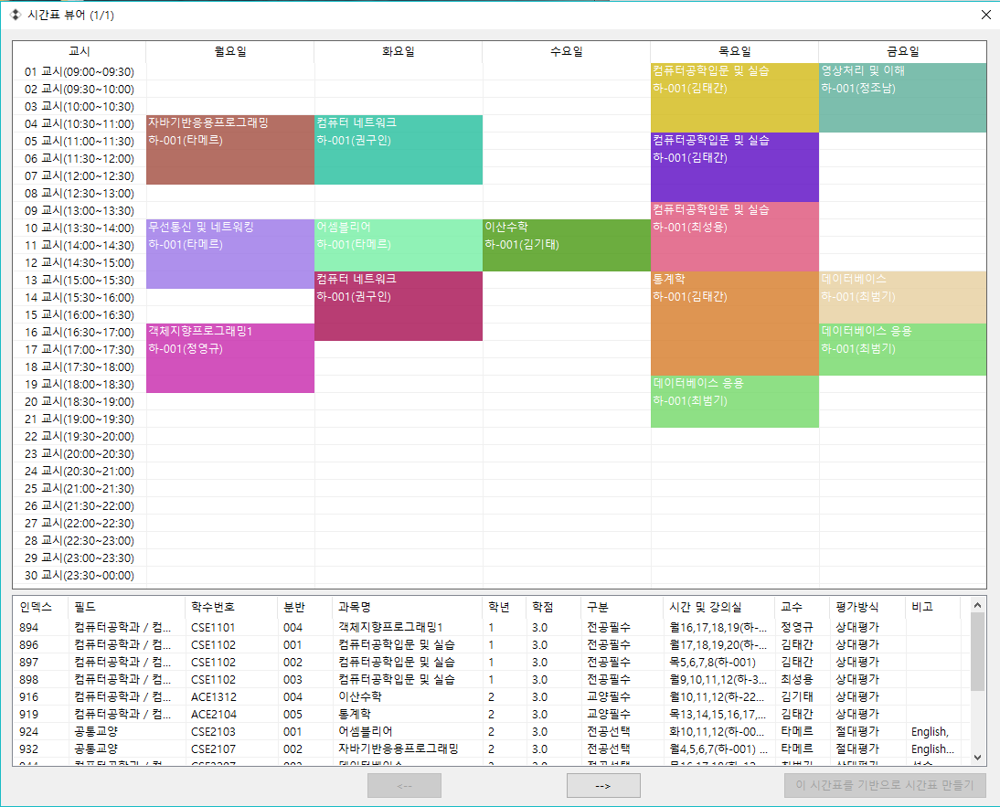
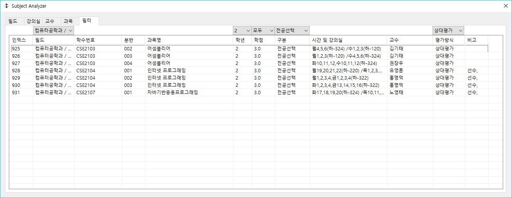

# InhaTimeTable Manager (인하대학교 시간표제작 프로그램)

이 프로그램을 이용하면 사용자는 직접 시간표를 작성할 수 있고, 모든 경우의 수로 시간표를 자동 생성할 수 있습니다. 시간표 유형은 인하대학교 수강신청 홈페이지의 교과과목과 동일하며, 모든 과목 정보들도 같은 페이지에서 얻었습니다.

### 시간표 작성시 유의사항

이 프로그램의 주요 목적은 시간표를 생성하는 것입니다. 강의실을 보여주거나 작성된 시간표를 시각적으로 보여 주는 등 여러가지 편의기능을 제공하지만, 이 기능들은 언제든지 없어질 수 있으며, 업데이트되지 않을 수 있습니다. 프로그램 사용법에 대한 자세한 설명은 프로그램을 실행하여 상단 `도구`탭에서 `사용법`을 눌러 확인해 주세요. 만약 설명된 내용이 부족한 부분에 관해선 개발자 메일로 남겨주시기 바랍니다.

### 최신 릴리즈

최신 시간표 정보와 릴리즈를 다운받고 사용해보세요.

주소: https://github.com/rollrat/InhaTT/releases/download/0.4/Release.7z 

---

## 스크린샷

### 시간표 생성기





### 시간표 분석기







---

## 개발 방법

### 시간표 체계(포팅방법)

인하대학교 시간표 체계는 30분 단위 25교시입니다. 이 부분에 대한 수정이 필요하면 다음을 참고하십시오.

``` csharp
// 가장 먼저 수정해야 할 부분은 TT/TimeTable.cs와 TT/TimeParser.cs, TT/TimeElement.cs입니다. 
// TimeTable.cs파일에서, 가령 20교시 체제를 사용 중이라면, 
bool[] table = new bool[25*5];
for ( int i = 0; i < 25 * 5; i++ ) 
// 부분입니다. 여기서 25는 '교시'를 나타내며 5는 월화수목금을 나타냅니다.
// 토요일까지 시간표를 확장하여 사용하려면 5를 6으로 고쳐 사용하십시오.

// 다음으로 TimeParser.cs파일에선, 
j = 25 * dayOfWeek.IndexOf(i[0]);
// 에서 25를 20으로 고칩니다. 토요일까지 확장하려면 `dayOfWee`k의 리터럴값을 "월화수목금토"로 수정하십시오.

// TimeElement.cs파일에선,
if (i / 25 == k)
if (i % 25 == k - 1)
// 를
if (i / 20 == k)
if (i % 20 == k - 1)
// 로 수정합니다.

// 이후 GUI부분을 수정하려면, frmMain.cs/frmTTViewer.cs를 수정해야합니다.
// 이 두 파일의 수정방법은 같으니 같이 설명하겠습니다. 먼저, `InitTableTime`함수에서
for (int i = 1; i <= 25; i++)
// 25를 20으로 고칩니다. 그 후 30분 단위 체계가아닌 1시간 단위인경우
dt = dt.AddMinutes(30);
// 을
dt = dt.AddHour(1);
// 로 고칩니다. 다음으로 GUI를 적절히 수정하여 사용합니다.
```

TimeTable은 강의시간 중복확인을 위해 존재하며, TimeElement는 한 과목의 강의시간 정보를 담고있습니다.

### 프로그램 시작 구조

datas파일이 없으면 실행될 수 없게끔 Program.cs를 수정하였습니다. frmMain오브젝트가 생성되면 생성자에서 파일의 존재유무를 확인하고, 존재하지 않는 다면 모든 프로그램 초기화를 무효화하고, 오브젝트 추가를 취소합니다.

## 시간표 생성기 구조

시간표 생성기는 스택을 이용한 단순한 구조로 작성되었습니다. 이 프로그램에서 시간표를 `테스트`하는 방법은 다음과 같습니다.

```
1. 모든 웹 강의를 삭제합니다.
2. 분반의 수가 적은 순으로 테스트 대상을 리스트에 넣습니다.
3. 시간표가 겹치는 지의 여부를 확인하기 위한 TimeTable를 생성합니다.
4. 리스트 요소를 순서대로 각 리스트 요소의 요소를 스택에 차례로 넣습니다.
   이때, 겹치는 시간이 존재하면 건너뜁니다.
5. 스택이 꽉찬 경우 결과리스트에 추가합니다.
   결과리스트엔 최대 100,000개까지 추가될 수 있습니다.
6. 100,000개 중 랜덤으로 100개를 뽑습니다.
```

## 데이터 파일을 추출하는 방법

InhaTT Downloader를 이용하여 사용자가 직접 데이터를 추출해야 합니다. 데이터 추출 방법은 다음과 같습니다.

```
1. InhaTT Downloader를 빌드 후 실행하여 모든 과정이 완료될 때까지 기다립니다.
   모든 과정은 프로그램 시작부터 끝까지 자동으로 진행됩니다.
   (만약 이 부분에서 오류가 생길 경우 시간표 양식이 바뀌었을 확률이 큽니다. 이 경우엔 
   InhaTT Downloader를 해당 약식에 맞게 수정한 후 다시 빌드해야합니다.)
2. 추출된 5개의 파일 중 datas.txt파일을 datas로 이름을 바꾸어 InhaTT.exe가 존재하는 폴더에
   함께 넣습니다.
```

---

## TODO

```
HtmlAgilityPack을 이용해 파서 구조를 간략화 할 계획이 있습니다.
```